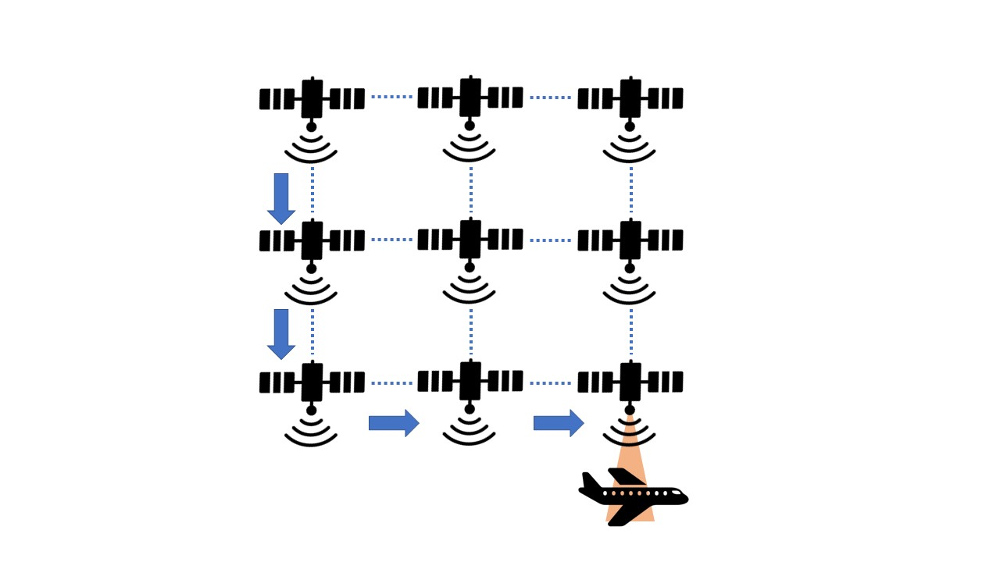
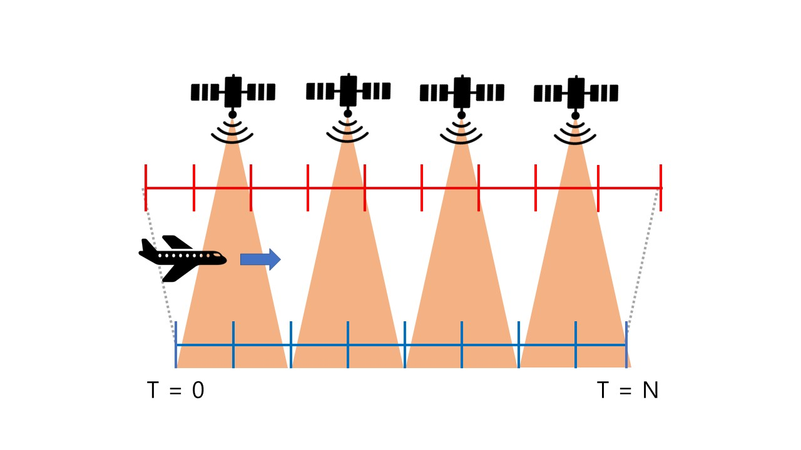

# Contents-Delivering-Network-on-Constellation-Satellite-using-THz

## Overview
Opens up new possibilities in satellite communications. Distant devices are faster due to his communication will be able to do. This paper is in space to be ready to mesh constellation satellite network the rapidly moving airplanes and satellites and open about how to send and receive content. In addition, content delivery sequence optimization and how to optimize energy research. Communication between satellites, airplanes, and intersatellite was made possible using the THz bandwidth. The optimization problem is assumed to have different available power in the Mesh constellation satellite network and is solved using the Dijkstra algorithm considering the power of satellites. And order to optimize energy Reinforcement learning and fix the problem. As a result, the proposed method was the only way to satisfy a given latency (0.1 s) compared to using power at random and other methods with minimal power. This was a method of appropriately using energy while maintaining the maximum latency time in communication.

## How to Run 
python test.py

## Version Information 
- Python 3.8
- Pytorch 1.8.0(cuda 11.1)
- Unity 2021
- ML-Agents 1.9(Unity Package)
- ML-Agents 0.26.0(Python Package)

## License
Copyright (c) 2022 Networking Intelligence Laboratory
Redistribution and use in source and binary forms, with or without modification, are permitted provided that the following conditions are met:

1. Redistributions of source code must retain the above copyright notice, this list of conditions and the following disclaimer.

2. Redistributions in binary form must reproduce the above copyright notice, this list of conditions and the following disclaimer in the documentation and/or other materials provided with the distribution.

THIS SOFTWARE IS PROVIDED BY THE COPYRIGHT HOLDERS AND CONTRIBUTORS "AS IS" AND ANY EXPRESS OR IMPLIED WARRANTIES, INCLUDING, BUT NOT LIMITED TO, THE IMPLIED WARRANTIES OF MERCHANTABILITY AND FITNESS FOR A PARTICULAR PURPOSE ARE DISCLAIMED. IN NO EVENT SHALL THE COPYRIGHT HOLDER OR CONTRIBUTORS BE LIABLE FOR ANY DIRECT, INDIRECT, INCIDENTAL, SPECIAL, EXEMPLARY, OR CONSEQUENTIAL DAMAGES (INCLUDING, BUT NOT LIMITED TO, PROCUREMENT OF SUBSTITUTE GOODS OR SERVICES; LOSS OF USE, DATA, OR PROFITS; OR BUSINESS INTERRUPTION) HOWEVER CAUSED AND ON ANY THEORY OF LIABILITY, WHETHER IN CONTRACT, STRICT LIABILITY, OR TORT (INCLUDING NEGLIGENCE OR OTHERWISE) ARISING IN ANY WAY OUT OF THE USE OF THIS SOFTWARE, EVEN IF ADVISED OF THE POSSIBILITY OF SUCH DAMAGE.
